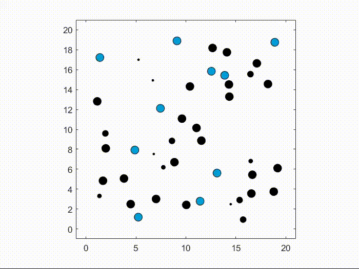

# Overview
               
 

Circle N=50                  |   Random N=50       | 
:-------------------------:|:-------------------------:|
  |  | 

This is the implementation of the Rule-Based Lloyd algorithm (RBL) for multi-robot motion planning and control. 

The simulator can run on all major platforms (Windows, Linux, and macOS). All that is required is cloning the repository and installing some necessary dependencies.

    git clone https://github.com/manuelboldrer/RBL

### Reference
In this repository there is part of the code that was used to generate simulation results in the following paper: 

"Rule-Based Lloyd Algorithm for Multi-Robot Motion Planning and Control with Safety and Convergence Guarantees."
Manuel Boldrer, Alvaro Serra-Gomez, Lorenzo Lyons, Javier Alonso-Mora, Laura Ferranti. 

**[`PDF_arxiv`](https://arxiv.org/pdf/2310.19511.pdf)** 

**[`Youtube video`](https://www.youtube.com/watch?v=ZCm-KYHxNG4)** 
 

### Prerequisites
- Python >3.9 & Pip
- Python Packages as defined in [requirements.txt](requirements.txt) 

## Setup
Install Python Packages
    
    pip install -r requirements.txt

Test Simulation with render

    python3 main.py -render

Test Simulation writing .txt file

    python3 main.py -writefile

## Acknowledgements

Giovanni Franzese,
Alvaro Serra Gomez,
Lorenzo Lyons,
Laura Ferranti,
Javier Alonso-Mora.

